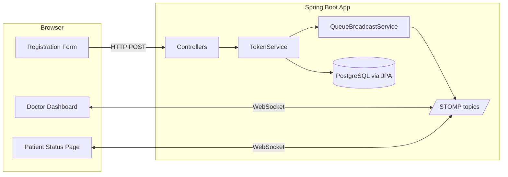
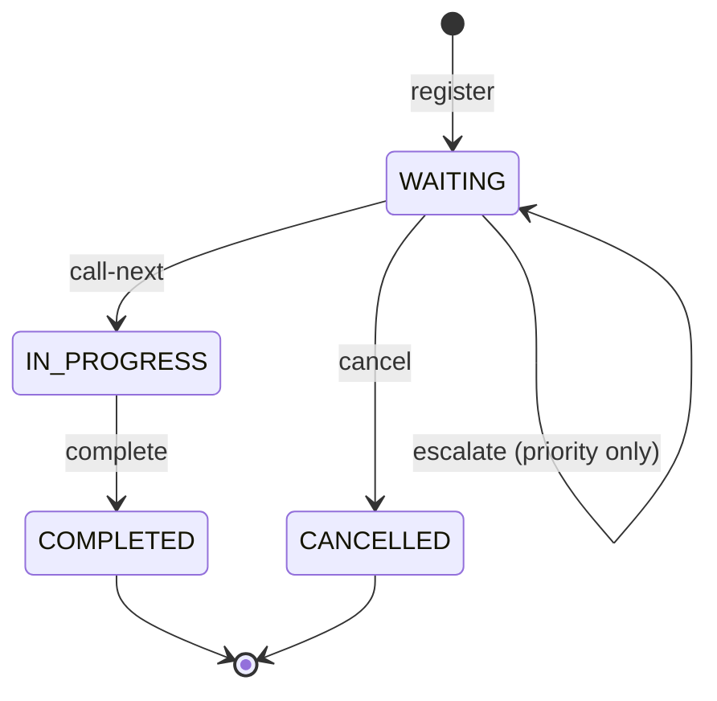

# Smart Queue Management System for Hospitals

A real-time hospital token-queue web app: staff register patients, doctors work a live queue, and patients track their own token on a no-login page — every screen updated by WebSocket push, never by polling.

## Description

Hospitals hand out paper tokens, but a paper token never tells a patient *when* they will be seen, and a printed board cannot reshuffle a doctor's queue when an emergency walks in. This project fixes both:

- Staff register a walk-in patient against a doctor and the system issues a queue token.
- The **doctor's dashboard** shows who is being served and who is waiting, in the correct order, and updates the instant anything changes.
- The **patient's tracking page** (`/patients/{tokenId}`, no login) shows their live position and estimated wait, with a "your turn is almost here" banner.
- **Emergency / priority** patients are reordered to the front automatically, and every screen watching that doctor re-sorts live.
- A **staff analytics page** shows historical load and consultation times, derived entirely from completed tokens.

It was built as a small, fully-readable **portfolio project**. The goal is a clean codebase that demonstrates sound architecture — real-time updates without an SPA, one source of truth for business rules, mixed authenticated/unauthenticated routes — not scale or hospital-grade robustness. See [`PRD.md`](PRD.md) for the full product brief and [`PLAN.md`](PLAN.md) for the technical plan.

## Badges


> This repository has no CI workflow and no licence file, so no build-status or licence badge is shown. CI is listed under [Roadmap](#roadmap) as a possible future addition.

## Result

Running `./mvnw spring-boot:run` against a local Postgres gives a working end-to-end demo out of the box (Flyway seeds 4 departments, 4 doctors, 5 patients, and 5 login accounts):

1. Sign in as `staff`, register three patients for the same doctor with mixed priorities.
2. Open that doctor's dashboard in one tab and each patient's `/patients/{tokenId}` page in others.
3. Escalating a `NORMAL` patient to `EMERGENCY`, or calling / completing a patient, re-sorts the dashboard **and** every patient page at the same moment — no refresh, no polling.
4. After a few completed consultations, `/analytics` shows patients-per-day, average consultation time, and average wait.

The non-trivial logic is covered by **12 unit tests** (`TokenServiceTest`, `WaitTimeEstimatorTest`):

```bash
./mvnw test
```

No screenshots are stored in the repository; the [walkthrough](#run-it-end-to-end) lists each screen and the expected behaviour.

## Where to Start

**Read in this order.**

| # | Document | For |
| - | -------- | --- |
| 1 | [Setup](#setup) (this README) | Install Postgres, create the database, run the app |
| 2 | [Run it end to end](#run-it-end-to-end) (this README) | Drive every screen step by step |
| 3 | [`PLAN.md`](PLAN.md) | Package layout, schema, endpoint table, phased build order |
| 4 | [`PRD.md`](PRD.md) | What was built and why; users; what is explicitly out of scope |
| 5 | [`TECH_STACK.md`](TECH_STACK.md) | Why each technology was chosen and what the project teaches |
| 6 | [`CLAUDE.md`](CLAUDE.md) | Standing architecture rules the code is held to |

> The rest of this README is the summary: concepts, architecture, setup, walkthrough, routes, and testing.

## Table of Contents

- [Smart Queue Management System for Hospitals](#smart-queue-management-system-for-hospitals)
  - [Description](#description)
  - [Badges](#badges)
  - [Result](#result)
  - [Where to Start](#where-to-start)
  - [Table of Contents](#table-of-contents)
  - [What Problem This Solves](#what-problem-this-solves)
  - [Concepts You Need First](#concepts-you-need-first)
  - [How It All Fits Together](#how-it-all-fits-together)
  - [Tech Stack](#tech-stack)
  - [Features](#features)
  - [Architecture](#architecture)
  - [UML Diagrams](#uml-diagrams)
  - [Repository Map](#repository-map)
  - [Requirements](#requirements)
  - [Setup](#setup)
  - [The Data Model](#the-data-model)
  - [Queue Ordering and Wait-Time Logic](#queue-ordering-and-wait-time-logic)
  - [Run It End to End](#run-it-end-to-end)
  - [Demo Credentials](#demo-credentials)
  - [Routes](#routes)
  - [Testing](#testing)
  - [Build Steps](#build-steps)
  - [Roadmap](#roadmap)
  - [Lessons Learned](#lessons-learned)
  - [Troubleshooting](#troubleshooting)
  - [Glossary](#glossary)
  - [Documentation](#documentation)

## What Problem This Solves

Physical hospital queues don't tell a patient when they'll be seen and can't reorder themselves for an emergency. This project gives:

- Each patient a shareable link that live-updates their position and estimated wait, with a "you're next soon" alert — no need to keep asking the desk.
- Each doctor a queue that reorders itself instantly when an emergency case is registered or a waiting patient is escalated, with every watching screen kept in sync with the database.

## Concepts You Need First

If you're newer to backend web development, these are the ideas the project leans on:

- **Server-rendered pages (Thymeleaf):** the server builds full HTML pages and sends them to the browser. There is no React/Vue-style single-page app here — just a little vanilla JS for the live-update client.
- **WebSocket / STOMP / SockJS:** a WebSocket is a persistent two-way connection (unlike plain HTTP, which is one request → one response). STOMP is a small messaging protocol on top of it; SockJS is a fallback for browsers/networks that can't do raw WebSockets. Together they let the server *push* an update the moment something changes, instead of the browser repeatedly asking "anything new?" (polling).
- **Priority queue ordering:** waiting tokens are not plain first-come-first-served. They are ordered by priority tier first (`EMERGENCY` > `PRIORITY` > `NORMAL`), then by arrival time within a tier.
- **Role-based access (Spring Security):** some routes require a logged-in `STAFF` or `DOCTOR` account; the patient tracking page requires no login at all, by design.
- **Database migrations (Flyway):** the schema is defined by versioned SQL files (`V1__…sql`, `V2__…sql`, …) that run automatically on startup, instead of letting the ORM generate the schema.

## How It All Fits Together

```
Staff registers patient  →  TokenService creates a WAITING token
                              │
                              ▼
                    QueueBroadcastService
                    (the ONLY place that pushes updates)
                        │                    │
                        ▼                    ▼
        /topic/doctor/{id}/queue   /topic/patient/{tokenId}
                        │                    │
                        ▼                    ▼
              Doctor's dashboard      Patient's tracking page
              (live, no refresh)      (live, no refresh)
```

Every state change (register, call-next, complete, cancel, escalate) goes through `TokenService`, which calls `QueueBroadcastService` exactly once. That service rebuilds the current queue snapshot from the database and pushes it to whoever is listening, so the dashboard and the patient pages are never out of sync with each other or with the database.

## Tech Stack

| Layer | Choice | Purpose |
| ----- | ------ | ------- |
| Language | Java 21 | Application language |
| Framework | Spring Boot 3.3.4 | Wiring, configuration, embedded server |
| Build | Maven (with `mvnw` wrapper) | Dependency management, builds the jar |
| Web / view | Spring MVC + Thymeleaf | Server-rendered HTML, no frontend build step |
| Frontend | Plain HTML/CSS + vanilla JS | STOMP client on the dashboard and patient pages only |
| Real-time | Spring WebSocket (STOMP over SockJS) | Pushes live queue changes to browsers |
| Database | PostgreSQL | Relational data (patients, tokens, doctors) |
| Data access | Spring Data JPA / Hibernate | Repository interfaces instead of raw SQL |
| Migrations | Flyway | Versioned SQL schema + seed data, applied on startup |
| Security | Spring Security (form login) | Staff/doctor routes gated by role; patient page open |
| Testing | JUnit 5 + Mockito (+ AssertJ) | Unit tests for the queue and wait-time logic |

**Deployment shape:** one Spring Boot jar + one Postgres database. No Docker, Redis, Kafka, or microservices — everything runs as a single app on a single machine, on purpose. The reasoning behind each choice is in [`TECH_STACK.md`](TECH_STACK.md).

## Features

- **Patient registration & token generation** — staff pick a doctor and priority; the system issues a token number that is sequential per doctor per day.
- **Live doctor dashboard** — queue view updates instantly as patients register, are called, or complete — no manual refresh.
- **Unauthenticated patient portal** — `/patients/{tokenId}` shows live status, queue position, and estimated wait, with a "your turn is almost here" banner (triggered at position ≤ 2 or ETA ≤ 10 minutes).
- **Priority / emergency handling** — `EMERGENCY` > `PRIORITY` > `NORMAL`, FIFO within a tier; staff can escalate a waiting patient and the queue re-sorts live for everyone watching.
- **Wait-time estimation** — a plain statistical formula (queue position × the doctor's rolling average consultation time), no ML.
- **Historical analytics** — patients served per day, average wait, and average consultation time per doctor, over a 14-day window, derived entirely from completed tokens.
- **Role-based auth** — Spring Security form login; `STAFF` registers patients and views analytics, `DOCTOR` runs their dashboard, the patient portal needs no login by design.

## Architecture

The app is a single Spring Boot process in standard layers:

- **`controller/`** — thin Spring MVC controllers. They render Thymeleaf pages and translate form posts into service calls; they hold no business logic.
- **`service/`** — where the logic lives:
  - `TokenService` — the only place tokens change state (register, call-next, complete, cancel, escalate). Every method is `@Transactional` and ends by calling `QueueBroadcastService`.
  - `QueueBroadcastService` — the single place STOMP messages are sent. It also builds the snapshot used for the *initial* page render, so the first paint and the live push are never two different code paths.
  - `WaitTimeEstimator` — rolling-average consultation time × queue position.
  - `AnalyticsService` — aggregates completed `Token` rows in plain Java.
- **`repository/`** — Spring Data JPA interfaces. `TokenRepository.findWaitingQueueForDoctor` is the **single definition of queue order** (see below).
- **`entity/`** — JPA entities (`Department`, `Doctor`, `Patient`, `Token`, `StaffUser`) and enums (`Priority`, `TokenStatus`, `StaffRole`).
- **`dto/`** — plain view objects pushed over WebSocket / rendered by templates (`QueueSnapshot`, `TokenView`, `PatientStatusView`, `DailyStats`, `DoctorStats`, `PatientRegistrationForm`).
- **`config/`** — `SecurityConfig` (route rules) and `WebSocketConfig` (`/ws` endpoint, `/topic` broker).

**External dependencies:** PostgreSQL (data + Flyway migration history) and the SockJS/STOMP WebJar scripts served to the browser. Nothing else.

Concrete service/controller classes only — no `service.impl` split, no generic base repository, no mapper framework. See [`CLAUDE.md`](CLAUDE.md) for the full set of working rules.

## UML Diagrams

**Component overview**



**Token lifecycle (state diagram)**



**Sequence: doctor calls the next patient**


## Repository Map

```
hospital-queue/
├── src/main/java/com/hospitalqueue/
│   ├── config/         SecurityConfig, WebSocketConfig
│   ├── controller/     PatientRegistration, QueueDashboard, PatientStatus, Analytics
│   ├── entity/         Department, Doctor, Patient, Token, StaffUser + enums
│   ├── repository/     Spring Data JPA repositories
│   ├── service/        TokenService, WaitTimeEstimator, QueueBroadcastService,
│   │                   AnalyticsService, StaffUserDetailsService
│   └── dto/            QueueSnapshot, TokenView, PatientStatusView, DailyStats,
│                       DoctorStats, PatientRegistrationForm
├── src/main/resources/
│   ├── templates/      Thymeleaf pages (register, register-success, dashboard,
│   │                   patient-status, analytics)
│   ├── static/css, static/js   Stylesheet + STOMP client scripts
│   ├── db/migration/   V1 schema, V2 demo data, V3 staff accounts
│   └── application.yml DB connection + app config
├── src/test/java/…     TokenServiceTest, WaitTimeEstimatorTest
├── PRD.md              Product brief: what to build and why
├── PLAN.md             Technical plan: architecture, schema, build order
├── TECH_STACK.md       Tech choices and what the project teaches
├── CLAUDE.md           Standing working rules for this codebase
├── PASSWORDS.md        Seeded demo login credentials
├── mvnw, mvnw.cmd      Maven wrapper (no separate Maven install needed)
└── pom.xml             Maven build file
```

## Requirements

- **JDK 21 or newer** (`java.version` is 21).
- **PostgreSQL** running locally, reachable at `localhost:5432`.
- **Maven** — optional; the repo ships the `./mvnw` / `mvnw.cmd` wrapper. The wrapper needs `JAVA_HOME` pointed at a JDK 21+ install.
- **No environment variables required.** The DB URL, username, and password are read from [`src/main/resources/application.yml`](src/main/resources/application.yml) (defaults: database `hospital_queue`, user/password `postgres`/`postgres`). Override locally with `application-local.yml` if needed — it is git-ignored.

## Setup

1. Create the database:

   ```sql
   CREATE DATABASE hospital_queue;
   ```

2. Confirm the connection settings in [`src/main/resources/application.yml`](src/main/resources/application.yml) match your local Postgres.

3. Run the app. Flyway applies `V1`–`V3` (schema, demo data, staff accounts) automatically on startup:

   ```bash
   ./mvnw spring-boot:run        # Windows: mvnw.cmd spring-boot:run
   ```

4. Open <http://localhost:8080/login> and sign in with an account from [`PASSWORDS.md`](PASSWORDS.md).

## The Data Model

```
Department(id, name)
Doctor(id, name, department_id → Department)
Patient(id, full_name, phone)
Token(id, token_number, patient_id → Patient, doctor_id → Doctor,
      priority, status, created_at, called_at, completed_at)
StaffUser(id, username, password_hash, role, doctor_id nullable → Doctor)
```

- `priority` ∈ `NORMAL | PRIORITY | EMERGENCY`; `status` ∈ `WAITING | IN_PROGRESS | COMPLETED | CANCELLED` (both enforced by `CHECK` constraints in `V1__init_schema.sql`).
- `token_number` is sequential **per doctor per calendar day**.
- One composite index, `(doctor_id, status)`, backs the queue-ordering query every screen depends on.
- There is deliberately **no separate analytics/history table** — historical stats and the wait-time estimator both read completed `Token` rows: `completed_at − called_at` is consultation duration, `called_at − created_at` is the actual wait. One source of truth. (See [`PLAN.md §4`](PLAN.md).)

## Queue Ordering and Wait-Time Logic

**Queue order — one definition, everywhere.** `TokenRepository.findWaitingQueueForDoctor(doctorId)` returns a doctor's `WAITING` tokens ordered `EMERGENCY`, then `PRIORITY`, then `NORMAL`, and by `created_at` ascending (oldest first) within a tier. The dashboard list, each patient's position number, and every wait estimate call this one method — the ordering is never re-implemented anywhere else.

**Wait-time estimate.**

```
avgConsultationMinutes = average(completed_at − called_at)
                         over the doctor's 10 most recent completed tokens
                         (falls back to 15 minutes if there is no history yet)

estimatedWaitMinutes   = positionAheadInQueue × avgConsultationMinutes
```

A plain, explainable formula in `WaitTimeEstimator` — no ML, no prediction library.

**Priority handling.** Registering or escalating to `PRIORITY` / `EMERGENCY` never interrupts an in-progress consultation; it only changes where the token lands in the `WAITING` ordering above. Escalation is allowed only while the token is still `WAITING`.

**"Turn is near" flag.** `QueueBroadcastService` sets it on a patient's status when their position ≤ 2 **or** their estimated wait ≤ 10 minutes.

## Run It End to End

1. **Sign in** at `/login` (Spring Security's default page) as `staff` or a doctor account — see [Demo Credentials](#demo-credentials).
2. **Register a patient** — `GET`/`POST /register`: pick a doctor, set a priority, submit. The confirmation page links to the doctor's dashboard and to the patient's own tracking page.
3. **Watch the live dashboard** — `GET /doctors/{doctorId}/dashboard`. As that `DOCTOR`, click **Call next patient** to move the first waiting token to `IN_PROGRESS`, then **Complete consultation**. Both actions push a live update to every screen watching this doctor.
4. **Escalate priority** — from the dashboard, `STAFF` bumps a waiting patient's priority; the queue re-sorts immediately for everyone watching.
5. **Track a token** — `GET /patients/{tokenId}` (no login) shows that one patient's live status, position, and ETA, with the "turn is near" banner once the threshold is crossed.
6. **View analytics** — `GET /analytics` (as `STAFF`): tables of patients served per day, average wait, and average consultation time per doctor.

## Demo Credentials

Seeded by `V3__seed_staff_users.sql` — academic demo accounts only, not production secrets. Full list in [`PASSWORDS.md`](PASSWORDS.md).

| Username | Password | Role | Doctor |
| -------- | -------- | ---- | ------ |
| `staff` | `staff123` | STAFF | — |
| `simi` | `simi123` | DOCTOR | Dr. Simi |
| `noor` | `noor123` | DOCTOR | Dr. Noor |
| `shyam` | `shyam123` | DOCTOR | Dr. Shyam |
| `george` | `george123` | DOCTOR | Dr. George |

## Routes

This app serves server-rendered HTML, not a JSON API — there is nothing to document beyond these routes. WebSocket clients connect to `/ws` (SockJS) and subscribe to `/topic/doctor/{doctorId}/queue` or `/topic/patient/{tokenId}`.

| Route | Method | Who | Purpose |
| ----- | ------ | --- | ------- |
| `/register` | GET, POST | STAFF | Register patient, issue token |
| `/doctors/{doctorId}/dashboard` | GET | DOCTOR | Live queue view + actions |
| `/doctors/{doctorId}/call-next` | POST | DOCTOR | Move next `WAITING` token to `IN_PROGRESS` |
| `/tokens/{tokenId}/complete` | POST | DOCTOR | Mark `IN_PROGRESS` token `COMPLETED` |
| `/tokens/{tokenId}/cancel` | POST | STAFF or DOCTOR | Cancel a token |
| `/tokens/{tokenId}/escalate` | POST | STAFF | Change a waiting token's priority |
| `/patients/{tokenId}` | GET | Anyone (no login) | Live status / position / ETA page |
| `/analytics` | GET | STAFF | Daily load + average consultation time |
| `/login` | GET, POST | Anyone | Spring Security default form login |
| `/ws` | — | Anyone | STOMP endpoint (SockJS handshake) |

## Testing

Tests cover the non-trivial logic only — `TokenService` state transitions and broadcast wiring, and `WaitTimeEstimator` math — not Thymeleaf templates or entity getters/setters (see [`PLAN.md §9`](PLAN.md)).

```bash
./mvnw test
```

- `TokenServiceTest` — token-number assignment, `callNext` guards (already-in-progress, empty queue), state transitions for complete/cancel, escalate allowed only while `WAITING`, and that every mutation calls `broadcastQueueChange`.
- `WaitTimeEstimatorTest` — rolling-average calculation, the 15-minute fallback with no history, and position × average.

## Build Steps

The project was built in **11** incremental, independently demoable phases: skeleton → domain model → registration → queue display → wait-time estimator → WebSocket wiring → patient portal → priority handling → analytics → auth → tests & polish. The full phase-by-phase plan is [`PLAN.md §8`](PLAN.md). There is no separate file-by-file build log.

## Roadmap

Everything below was deliberately scoped **out** to keep the project small and reviewable (see [`PRD.md §4`](PRD.md)). Listed as possible future improvements, not committed plans:

- SMS / email / push notifications for "your turn is near" (currently in-app only).
- ML-based wait-time prediction (currently a plain statistical average, by design).
- Multi-hospital / multi-tenant support.
- A CI pipeline (no `.github/workflows` exists in this repo).
- Fine-grained audit logging / compliance controls.

## Lessons Learned

- **Real-time without SPA complexity.** Server-rendered pages plus one STOMP topic per screen give live updates without React, a build pipeline, or polling.
- **One source of truth for a business rule.** Queue order lives in exactly one repository method; the dashboard, patient position, and wait estimate all derive from it, so no two screens can disagree.
- **Derive analytics from existing data.** Stats and wait estimates both read completed `Token` rows — no `ConsultationRecord` table, no reporting pipeline to keep in sync.
- **Simple, explainable prediction.** A rolling-average formula is easy to unit-test and easy to justify in an interview; ML would have been harder to build *and* harder to defend for this scope.
- **Mixed access rules in one Spring Security config.** Authenticated `STAFF` / `DOCTOR` routes and a fully open `/patients/**` route coexist in one filter chain.
- **Match architecture to problem size.** Skipping interface/impl pairs, generic base classes, and Docker was a deliberate judgement call, not an omission — see [`TECH_STACK.md`](TECH_STACK.md).

## Troubleshooting

- **WebJar scripts 404 (`/webjars/…`)** — this project doesn't include `webjars-locator`, so script tags use the exact versioned path (e.g. `/webjars/sockjs-client/1.5.1/sockjs.min.js`), not the unversioned shorthand.
- **Flyway migrations not picked up after editing a `.sql` file** — the Flyway Maven plugin reads from `target/classes`, not `src/main/resources`. Run `./mvnw process-resources` before `./mvnw flyway:migrate`. (Running the app instead applies migrations from the classpath normally.)
- **Mockito "cannot mock this class" on newer JDKs** — if your JDK is newer than the one Spring Boot's BOM targets, `mockito.version` and `byte-buddy.version` are overridden in `pom.xml`'s `<properties>` block for exactly this reason.
- **`JAVA_HOME` not set** — the Maven wrapper needs `JAVA_HOME` pointing at a JDK 21+ install before you run `./mvnw …`.

## Glossary

| Term | Meaning |
| ---- | ------- |
| **Token** | One patient's place in a doctor's queue — has a status, a priority, and timestamps. |
| **Priority tier** | `NORMAL`, `PRIORITY`, or `EMERGENCY` — decides queue order ahead of arrival time. |
| **STOMP** | A small text messaging protocol used over WebSocket to carry queue updates. |
| **SockJS** | A fallback library that emulates WebSockets where a browser/network can't use them directly. |
| **Flyway migration** | A versioned SQL file (`V1__…sql`) that Flyway runs once, in order, to build or update the schema. |
| **Snapshot** | The full re-sorted queue (`QueueSnapshot`) rebuilt from the DB and pushed on every change. |
| **STAFF / DOCTOR** | The two authenticated roles; patients have no account or role at all. |

## Documentation

| Document | Contents |
| -------- | -------- |
| [`PRD.md`](PRD.md) | Product brief — features, users, non-functional requirements, out-of-scope items |
| [`PLAN.md`](PLAN.md) | Technical plan — package layout, schema, endpoint table, real-time design, 11-phase build order |
| [`TECH_STACK.md`](TECH_STACK.md) | Every technology choice, the reasoning, and what the project teaches |
| [`CLAUDE.md`](CLAUDE.md) | Standing architecture rules the code is held to |
| [`PASSWORDS.md`](PASSWORDS.md) | Seeded demo login credentials |

> # Built a real-time hospital queue management system (Java 21, Spring Boot 3, PostgreSQL, WebSocket/STOMP) that pushes queue and wait-time updates to doctor dashboards and patient portals in under 1 second with zero polling, replacing manual refresh; single source-of-truth queue ordering (priority tier + FIFO) drives dashboard, patient position, and ETA from one query.
