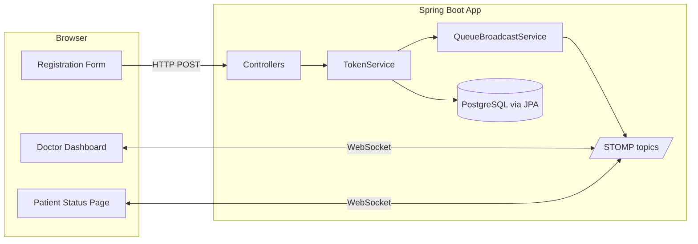
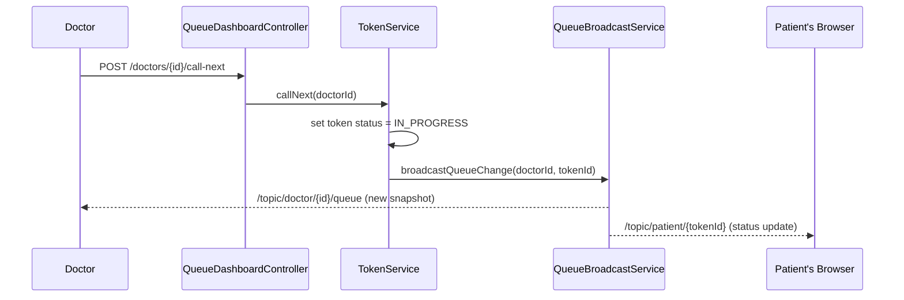

# Smart Queue Management System for Hospitals

A real-time hospital token-queue system: staff register patients, doctors work a live queue, and patients track their own token on an unauthenticated page — all pushed over WebSocket, no polling.


> No CI pipeline or license file exists in this repository, so no build-status or license badge is shown above — see [Roadmap](#roadmap) for CI as a possible future addition.

## Table of Contents

- [Smart Queue Management System for Hospitals](#smart-queue-management-system-for-hospitals)
  - [Table of Contents](#table-of-contents)
  - [Description](#description)
  - [What Problem This Solves](#what-problem-this-solves)
  - [Concepts You Need First](#concepts-you-need-first)
  - [How It All Fits Together](#how-it-all-fits-together)
  - [Features](#features)
  - [Tech Stack](#tech-stack)
  - [Architecture](#architecture)
    - [Data model](#data-model)
    - [Queue ordering — one definition, everywhere](#queue-ordering--one-definition-everywhere)
    - [Wait-time estimate](#wait-time-estimate)
    - [Real-time design](#real-time-design)
    - [Auth](#auth)
  - [Diagrams](#diagrams)
  - [Repository Map](#repository-map)
  - [Requirements](#requirements)
  - [Setup](#setup)
  - [Run It End to End (Walkthrough)](#run-it-end-to-end-walkthrough)
  - [Demo Credentials](#demo-credentials)
  - [Key Routes](#key-routes)
  - [Testing](#testing)
  - [Build Steps](#build-steps)
  - [Roadmap](#roadmap)
  - [Lessons Learned](#lessons-learned)
  - [Troubleshooting](#troubleshooting)
  - [Glossary](#glossary)
  - [Documentation](#documentation)

## Description

This project lets hospital staff register a walk-in patient against a doctor, issues that patient a queue token, and keeps three screens in sync in real time:

- the **doctor's dashboard** (who's being served, who's waiting, in what order),
- the **patient's own tracking page** (their position and estimated wait), and
- a **staff analytics page** (historical load and consultation times).

It was built as a small, fully-understandable **portfolio project** — the goal is a clean codebase that demonstrates sound architecture (real-time updates, one source of truth for business rules, role-based auth) without the scale or infrastructure of a real hospital system. See [`PRD.md`](PRD.md) for the full product brief.

## What Problem This Solves

Physical hospital queues (take a paper token, wait, watch a board) don't tell a patient *when* they'll be seen, and don't let a doctor's queue reorder itself when an emergency case walks in. This project solves both:

- A patient gets a shareable link that live-updates their position and estimated wait, with a "your turn is almost here" alert — no need to keep asking the desk.
- Emergency/priority patients get correctly reordered to the front of the queue, and every screen watching that doctor updates instantly.

## Concepts You Need First

If you're newer to backend web development, these are the ideas this project leans on:

- **Server-rendered pages (Thymeleaf):** the server builds full HTML pages and sends them to the browser, instead of the browser fetching JSON and rendering it (no React/Vue-style SPA here).
- **WebSocket / STOMP / SockJS:** a WebSocket is a persistent two-way connection between browser and server (unlike normal HTTP, which is one request → one response). STOMP is a simple messaging protocol layered on top of it; SockJS is a fallback so it still works if a browser/network can't do raw WebSockets. Together they let the server *push* updates to the browser the instant something changes, instead of the browser repeatedly asking "anything new?" (polling).
- **Priority queue ordering:** waiting tokens aren't just first-come-first-served — they're ordered by priority tier first (`EMERGENCY` > `PRIORITY` > `NORMAL`), and by arrival time within a tier.
- **Role-based access (Spring Security):** some pages require a logged-in `STAFF` or `DOCTOR` account; the patient tracking page requires no login at all, on purpose.
- **Database migrations (Flyway):** the database schema is defined by versioned SQL files (`V1__...sql`, `V2__...sql`, ...) that run automatically on startup, instead of letting the ORM auto-generate the schema.

## How It All Fits Together

```
Staff registers patient  →  TokenService creates a WAITING token
                              │
                              ▼
                    QueueBroadcastService
                    (the ONLY place that pushes updates)
                        │                    │
                        ▼                    ▼
        /topic/doctor/{id}/queue   /topic/patient/{tokenId}
                        │                    │
                        ▼                    ▼
              Doctor's dashboard      Patient's tracking page
              (live, no refresh)      (live, no refresh)
```

Every state change (register, call-next, complete, cancel, escalate) goes through `TokenService`, which calls `QueueBroadcastService` exactly once. That service rebuilds the current queue snapshot from the database and pushes it to whoever is listening — so the dashboard and the patient page are never out of sync with each other or with the database.

## Features

- **Patient registration & token generation** — staff pick a doctor and priority; the system issues a sequential token number.
- **Live doctor dashboard** — queue view updates instantly as patients register, get called, or complete — no manual refresh.
- **Unauthenticated patient portal** — `/patients/{tokenId}` shows live status, queue position, and estimated wait, with a "your turn is almost here" banner.
- **Priority / emergency handling** — `EMERGENCY` > `PRIORITY` > `NORMAL`, FIFO within a tier; staff can escalate a waiting patient's priority and the queue reorders live for everyone watching.
- **Wait-time estimation** — a plain statistical formula (queue position × the doctor's rolling average consultation time), no ML.
- **Historical analytics** — daily patient load and average consultation time per doctor, derived entirely from completed tokens.
- **Role-based auth** — Spring Security form login; `STAFF` registers patients and views analytics, `DOCTOR` runs their dashboard, the patient portal needs no login by design.

## Tech Stack


| Layer       | Choice                                                   |
| ------------- | ---------------------------------------------------------- |
| Language    | Java 21                                                  |
| Framework   | Spring Boot 3.3.4                                        |
| Build tool  | Maven                                                    |
| Web layer   | Spring MVC + Thymeleaf (server-rendered)                 |
| Frontend    | Plain HTML/CSS + a little vanilla JS (STOMP client only) |
| Real-time   | Spring WebSocket (STOMP over SockJS)                     |
| Database    | PostgreSQL                                               |
| Data access | Spring Data JPA / Hibernate                              |
| Migrations  | Flyway                                                   |
| Security    | Spring Security (form login)                             |
| Tests       | JUnit 5 + Mockito                                        |

**Deployment shape:** one Spring Boot jar + one Postgres database. No Docker, Redis, Kafka, or microservices — everything runs as a single app on a single machine, on purpose.

For the *why* behind each choice, see [`TECH_STACK.md`](TECH_STACK.md).

## Architecture

### Data model

```
Department(id, name)
Doctor(id, name, department_id)
Patient(id, full_name, phone)
Token(id, token_number, patient_id, doctor_id, priority, status,
      created_at, called_at, completed_at)
StaffUser(id, username, password_hash, role, doctor_id nullable)
```

There is deliberately **no separate analytics/history table** — historical stats and the wait-time estimator both read from completed `Token` rows (`completed_at - called_at` = consultation duration). One source of truth, fewer moving parts.

### Queue ordering — one definition, everywhere

```sql
ORDER BY priority DESC, created_at ASC   -- over WAITING tokens for a doctor
```

Every place that needs queue order (dashboard, a patient's position number, the wait estimate) derives from this same query — it is never re-implemented a second way.

### Wait-time estimate

```
avgConsultationMinutes = average(completed_at - called_at)
                          over the doctor's recent completed tokens
                          (falls back to a default if no history yet)

estimatedWaitMinutes = positionAheadInQueue × avgConsultationMinutes
```

A plain, explainable statistical formula — no ML.

### Real-time design

- `QueueBroadcastService` is the single place that pushes STOMP messages, called after every state-changing `TokenService` operation (register, call-next, complete, cancel, escalate).
- `/topic/doctor/{doctorId}/queue` — full re-sorted queue snapshot for that doctor's dashboard.
- `/topic/patient/{tokenId}` — that one patient's status, position, ETA, and "turn near" flag.
- Each client (dashboard, patient page) opens one STOMP-over-SockJS connection to `/ws` and re-renders its whole view from the message payload — no polling, no incremental DOM patching.

### Auth

Spring Security's default login page (no custom template). `STAFF` and `DOCTOR` roles gate the registration, dashboard, escalate, and analytics routes; `/patients/**` stays fully unauthenticated by design — it's a shareable, low-sensitivity link with no PII beyond a first name.

Concrete service/controller classes only — no `service.impl` split, no generic base repository, no mapper framework. See [`CLAUDE.md`](CLAUDE.md) for the full set of working rules this project follows.

## Diagrams

**Component overview**



**Sequence: doctor calls the next patient**



## Repository Map

```
hospital-queue/
├── src/main/java/com/hospitalqueue/
│   ├── config/             SecurityConfig, WebSocketConfig
│   ├── controller/         Registration, dashboard, patient-status, analytics
│   ├── entity/              Department, Doctor, Patient, Token, StaffUser (+ enums)
│   ├── repository/         Spring Data JPA repositories
│   ├── service/             TokenService, WaitTimeEstimator, QueueBroadcastService, AnalyticsService
│   └── dto/                  TokenView, QueueSnapshot, PatientStatusView, DailyStats, DoctorStats
├── src/main/resources/
│   ├── templates/           Thymeleaf pages (dashboard, register, patient-status, analytics)
│   ├── static/css, static/js   Stylesheet + STOMP client scripts
│   ├── db/migration/        Flyway SQL migrations (schema, demo data, staff accounts)
│   └── application.yml      DB connection + app config
├── src/test/java/...        Unit tests (TokenService, WaitTimeEstimator)
├── PRD.md                   Product brief: what to build and why
├── PLAN.md                  Technical plan: architecture, schema, build order
├── TECH_STACK.md            Tech choices and what the project teaches
├── CLAUDE.md                Standing working rules for this codebase
├── PASSWORDS.md             Seeded demo login credentials
└── pom.xml                  Maven build file
```

## Requirements

- JDK 21+
- PostgreSQL (running locally)
- Maven (or use the included `./mvnw` / `mvnw.cmd` wrapper — no separate install needed)
- No environment variables required — DB connection is read from `application.yml` (see [Setup](#setup))

## Setup

1. Create the database:

   ```sql
   CREATE DATABASE hospital_queue;
   ```
2. Check the connection settings in [`src/main/resources/application.yml`](src/main/resources/application.yml) match your local Postgres (defaults: `localhost:5432`, user/password `postgres`/`postgres`).
3. Run the app — Flyway migrates the schema and seeds demo data automatically on startup:

   ```bash
   ./mvnw spring-boot:run
   ```
4. Open [http://localhost:8080/login](http://localhost:8080/login) and sign in with one of the accounts in [`PASSWORDS.md`](PASSWORDS.md).

## Run It End to End (Walkthrough)

1. **Sign in** at `/login` (Spring Security's default page) as `staff` or a doctor account — see [Demo Credentials](#demo-credentials).
2. **Register a patient** — `GET/POST /register`: pick a doctor, set a priority, submit. The confirmation page links to the doctor's dashboard and the patient's own tracking page.
3. **Watch the live doctor dashboard** — `GET /doctors/{doctorId}/dashboard`. As `DOCTOR`, click **Call next patient** to move the first waiting token to `IN_PROGRESS`, then **Complete consultation** to free up the doctor for the next one. Both actions push a live update to anyone watching.
4. **Escalate priority** — from the dashboard, `STAFF` can bump a waiting patient's priority; the queue re-sorts immediately for everyone watching.
5. **Track a token** — `GET /patients/{tokenId}` (no login) shows that one patient's live status, position, and ETA, with a banner once their turn is near (position ≤ 2 or ETA ≤ 10 minutes).
6. **View analytics** — `GET /analytics` (as `STAFF`): plain tables of patients served per day and average consultation time per doctor.

## Demo Credentials

See [`PASSWORDS.md`](PASSWORDS.md) for the full list of seeded demo accounts (one `STAFF` account, one per doctor). These are academic-project demo credentials only, not production secrets.

## Key Routes


| Route                                | Who           | Purpose                                |
| -------------------------------------- | --------------- | ---------------------------------------- |
| `GET/POST /register`                 | STAFF         | Register patient, issue token          |
| `GET /doctors/{doctorId}/dashboard`  | DOCTOR        | Live queue view + call-next/complete   |
| `POST /doctors/{doctorId}/call-next` | DOCTOR        | Move next WAITING token to IN_PROGRESS |
| `POST /tokens/{tokenId}/complete`    | DOCTOR        | Mark IN_PROGRESS token COMPLETED       |
| `POST /tokens/{tokenId}/cancel`      | STAFF, DOCTOR | Cancel a waiting token                 |
| `POST /tokens/{tokenId}/escalate`    | STAFF         | Bump priority of a waiting token       |
| `GET /patients/{tokenId}`            | Anyone        | Live status/position/ETA page          |
| `GET /analytics`                     | STAFF         | Daily load + avg consultation time     |
| `/ws`                                | —            | STOMP endpoint (SockJS handshake)      |

This app serves server-rendered HTML, not JSON — there's no separate JSON API to document beyond the routes above.

## Testing

Unit tests focus on the non-trivial logic — `TokenService` queue ordering/state transitions and `WaitTimeEstimator` math — rather than Thymeleaf templates or entity getters/setters:

```bash
mvn test
```

## Build Steps

This project was built in 11 incremental, independently-demoable phases (skeleton → domain model → registration → queue display → wait-time estimator → WebSocket wiring → patient portal → priority handling → analytics → auth → tests/polish). The full phase-by-phase plan is in [`PLAN.md §8`](PLAN.md).

## Roadmap

The following were deliberately scoped **out** of this project to keep it small and reviewable (see [`PRD.md §4`](PRD.md)) — listed here as possible future improvements, not committed plans:

- SMS/email/push notifications for "your turn is near" (currently in-app only)
- ML-based wait-time prediction (currently a plain statistical average, by design)
- Multi-hospital / multi-tenant support
- A CI pipeline (no `.github/workflows` currently exists in this repo)
- Fine-grained audit logging / compliance controls (not needed for a portfolio project)

## Lessons Learned

This project was used to practice: real-time web updates without SPA/polling complexity, keeping one source of truth for business rules (queue ordering) instead of re-implementing it per screen, deriving analytics from existing data instead of a separate reporting pipeline, and mixing authenticated and unauthenticated routes correctly in one Spring Security config. See [`TECH_STACK.md`](TECH_STACK.md) for the full write-up of what each part of the stack was chosen to teach.

## Troubleshooting

- **Webjar scripts 404 (`/webjars/...`)** — this project doesn't include `webjars-locator`, so WebJar script tags must use the exact versioned path (e.g. `/webjars/sockjs-client/1.5.1/sockjs.min.js`), not the unversioned shorthand.
- **Flyway migrations not picked up after editing a `.sql` file** — the Flyway Maven plugin reads from `target/classes`, not `src/main/resources` directly. Run `mvn process-resources` before `mvn flyway:migrate`.
- **Mockito "cannot mock this class" on newer JDKs** — if your JDK is newer than what Spring Boot's dependency-management BOM was built against, override both `mockito.version` and `byte-buddy.version` in `pom.xml` (already done in this project — see the `<properties>` block).
- **`JAVA_HOME` not set** — the Maven wrapper (`mvnw`) needs `JAVA_HOME` pointed at a JDK 21+ install; set it in your shell before running `./mvnw ...` if you see a "JAVA_HOME not found" error.

## Glossary


| Term                 | Meaning                                                                                          |
| ---------------------- | -------------------------------------------------------------------------------------------------- |
| **Token**            | A single patient's place in a doctor's queue — has a status, priority, and timestamps.          |
| **Priority tier**    | `NORMAL`, `PRIORITY`, or `EMERGENCY` — determines queue order ahead of arrival time.            |
| **STOMP**            | A simple text-based messaging protocol used over WebSocket to send/receive queue updates.        |
| **SockJS**           | A fallback library that emulates WebSockets when a browser/network can't use them directly.      |
| **Flyway migration** | A versioned SQL file (`V1__...sql`) that Flyway runs once, in order, to build/update the schema. |
| **STAFF / DOCTOR**   | The two authenticated roles; patients have no account or role at all.                            |

## Documentation


| Document                         | Contents                                                                                    |
| ---------------------------------- | --------------------------------------------------------------------------------------------- |
| [`PRD.md`](PRD.md)               | Product brief — what to build, why, users, non-functional requirements, out-of-scope items |
| [`PLAN.md`](PLAN.md)             | Technical plan — package layout, schema, endpoints, real-time design, phased build order   |
| [`TECH_STACK.md`](TECH_STACK.md) | Tech choices, the reasoning behind each, and what the project teaches                       |
| [`CLAUDE.md`](CLAUDE.md)         | Standing working rules for this codebase                                                    |
| [`PASSWORDS.md`](PASSWORDS.md)   | Seeded demo login credentials                                                               |

> # Built a real-time hospital queue management system (Java 21, Spring Boot 3, PostgreSQL, WebSocket/STOMP) that pushes queue and wait-time updates to doctor dashboards and patient portals in under 1 second with zero polling, replacing manual refresh; single source-of-truth queue ordering (priority tier + FIFO) drives dashboard, patient position, and ETA from one query.
